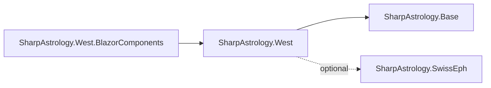
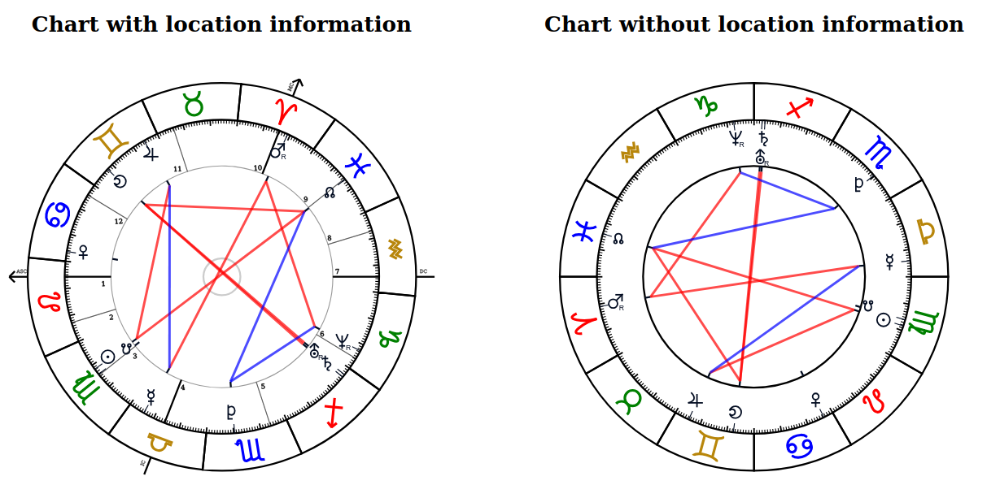
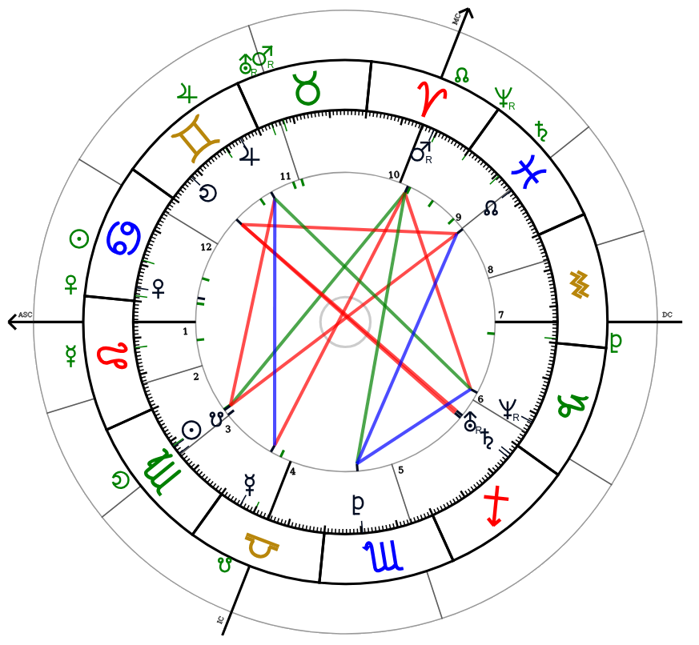
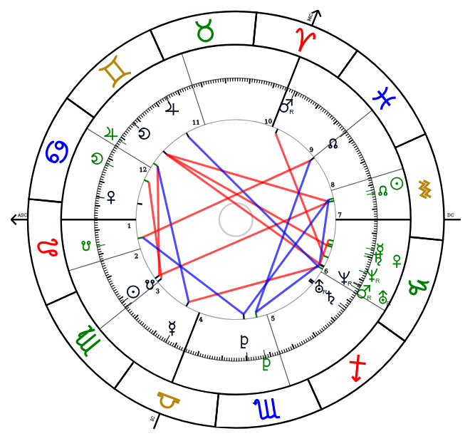

# SharpAstrology.West.BlazorComponents

This package provides useful Blazor components to display information of an AstrologyChart class from the SharpAstrology.Base package.

${\color{red}This \space package \space is \space still \space experimental. \space Interfaces \space can \space change \space before \space version \space 1.0.0.}$

## SharpAstrology Packages
| Package                                                                                                                | Version | Description                                   | Licence  |
|:-----------------------------------------------------------------------------------------------------------------------|:-------:|:----------------------------------------------|:--------:|
| [SharpAstrology.Base](https://github.com/CReizner/SharpAstrology.Base)                                                 | 0.10.0  | Base library                                  |   MIT    |
| [SharpAstrology.SwissEph](https://github.com/CReizner/SharpAstrology.SwissEph)                                         |  0.2.2  | Ephemerides package based on SwissEphNet      | AGPL-3.0 |
| [SharpAstrology.HumanDesign](https://github.com/CReizner/SharpAstrology.HumanDesign)                                   |  1.1.0  | Extensions for the Human Design system        |   MIT    |
| [SharpAstrology.HumanDesign.BlazorComponents](https://github.com/CReizner/SharpAstrology.HumanDesign.BlazorComponents) |  0.2.1  | Human Design charts as Blazor components      |   MIT    |
| [SharpAstrology.Vedic](https://github.com/CReizner/SharpAstrology.Vedic)                                               |  0.1.0  | Extensions for Vedic astrology systems        |   MIT    |
| [SharpAstrology.West](https://github.com/CReizner/SharpAstrology.West)                                                 |  0.1.0-preview.2  | Extensions for western astrology systems      |   MIT    |
| [SharpAstrology.West.BlazorComponents](https://github.com/CReizner/SharpAstrology.West.BlazorComponents)               |  0.1.0-preview.1  | Western astrology charts as Blazor components |   MIT    |

# Install
```dotnet add package SharpAstrology.West.BlazorComponents```

This package depends on SharpAstrology.West. Here is the dependency graph.



# Examples
## Setup
All examples use the [SharpAstrology.SwissEph](https://github.com/CReizner/SharpAstrology.SwissEph) package.

```dotnet add package SharpAstrology.SwissEph```

Create a Blazor project with interactive server components. Inject The SwissEphemeridesService.

Update the **program.cs** file. 
```razor
...
using SharpAstrology.Ephemerides;

...

builder.Services.AddRazorComponents()
    .AddInteractiveServerComponents();
builder.Services.AddSingleton<SwissEphemeridesService>();
...
```

## How can I display a basic chart in Blazor?
```razor
@using SharpAstrology.DataModels
@using SharpAstrology.Ephemerides
@using SharpAstrology.BlazorComponents
@rendermode InteractiveServer

<PageTitle>Astrology Chart Example</PageTitle>

<div style="display: flex; width: 1100px; align-items: center; flex-direction: row; justify-content: space-between">
    <div>
        <h2 style="text-align: center">Chart with location information</h2>
        <WesternAstrologyChart Height="500" Width="500"
                               Chart="chartWithLocation"/>
    </div>
    <div>
    <h2 style="text-align: center">Chart without location information</h2>
    <WesternAstrologyChart Height="500" Width="500"
                           Chart="chartWithoutLocation"/>
    </div>
</div>

@code
{
    [Inject] SwissEphemeridesService EphService { get; set; }
    private AstrologyChart chartWithLocation;
    private AstrologyChart chartWithoutLocation;
    
    protected override void OnInitialized()
    {
        using var eph = EphService.CreateContext();
        chartWithLocation = new AstrologyChart(new DateTime(1988, 9, 4, 1, 15, 0, DateTimeKind.Utc), eph, 51.0, 11.0);
        chartWithoutLocation = new AstrologyChart(new DateTime(1988, 9, 4, 1, 15, 0, DateTimeKind.Utc), eph);
    }
}
```


## How can I display a chart with transits?
```razor
@using SharpAstrology.DataModels
@using SharpAstrology.Enums
@using SharpAstrology.Ephemerides
@using SharpAstrology.BlazorComponents
@rendermode InteractiveServer

<PageTitle>Astrology Transit Chart Example</PageTitle>

<div style="display: flex; height: 850px; width: 850px; align-items: center; justify-content: center;">
    <WesternAstrologyChart Height="800" Width="800"
                           Chart="chart"
                           ChartComparator="transits"
                           ShowOnOuterWheel="WesternChartWheelOptions.Comparator"
                           IncludeAspects="[Aspects.Conjunction, Aspects.Opposition, Aspects.Sextile, Aspects.Square, Aspects.Trine, Aspects.Quincunx]"
                           OnClickCallback="(x)=>Console.WriteLine(x)"/>
</div>

@code
{
    [Inject] SwissEphemeridesService EphService { get; set; }
    private AstrologyChart chart;
    private AstrologyChart transits;
    
    protected override void OnInitialized()
    {
        using var eph = EphService.CreateContext();
        chart = new AstrologyChart(new DateTime(1988, 9, 4, 1, 15, 0, DateTimeKind.Utc), eph, 51.0, 11.0);
        transits = new AstrologyChart(DateTime.UtcNow, eph);
    }
}
```


## Can I create a combine chart with another person with aspects to each other?
```razor
@using SharpAstrology.DataModels
@using SharpAstrology.Ephemerides
@using SharpAstrology.BlazorComponents
@rendermode InteractiveServer

<PageTitle>Astrology Chart Example</PageTitle>

<div style="display: flex; width: 650px; align-items: center; justify-content: center">
         <WesternAstrologyChart Height="600" Width="600"
                                Chart="chart"
                                ChartComparator="chartComparator"
                                ShowOnInnerWheel="WesternChartWheelOptions.Comparator"
                                ShowOnOuterWheel="WesternChartWheelOptions.Signs"
                                ShowAspectsToOther="true"/>
</div>

@code
{
    [Inject] SwissEphemeridesService EphService { get; set; }
    private AstrologyChart chart;
    private AstrologyChart chartComparator;
    
    protected override void OnInitialized()
    {
        using var eph = EphService.CreateContext();
        chart = new AstrologyChart(new DateTime(1988, 9, 4, 1, 15, 0, DateTimeKind.Utc), eph, 51.0, 11.0);
        chartComparator = new AstrologyChart(new DateTime(1990, 2, 6, 22, 50, 0, DateTimeKind.Utc), eph);
    }
}
```


